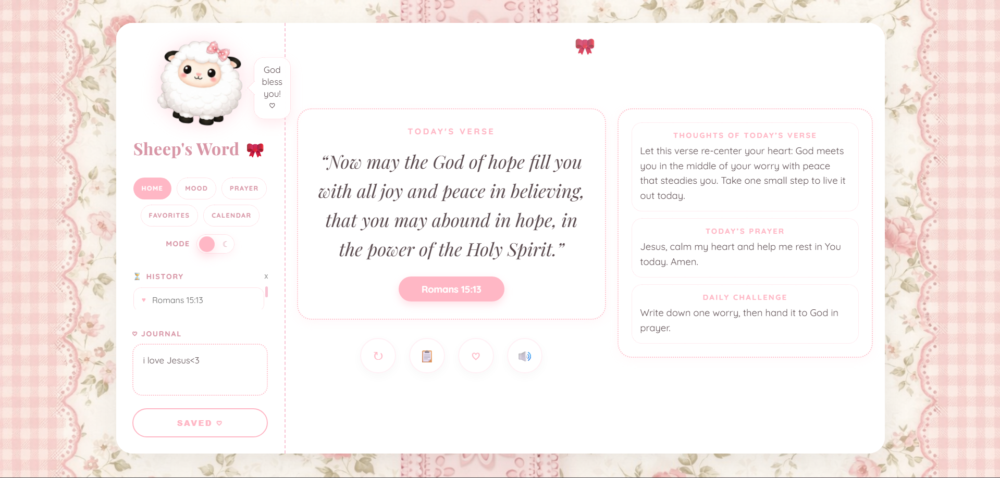
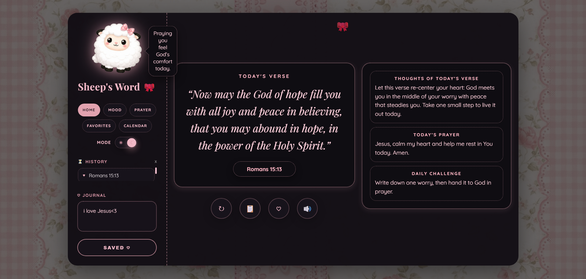
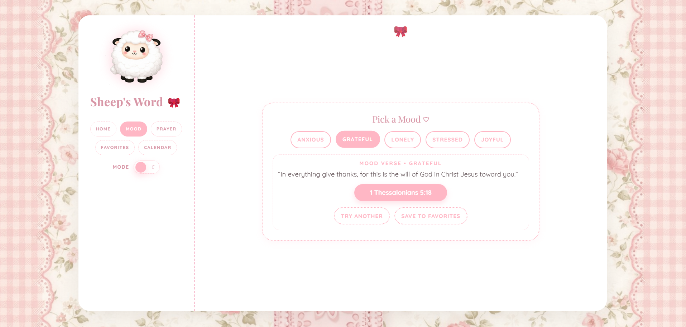
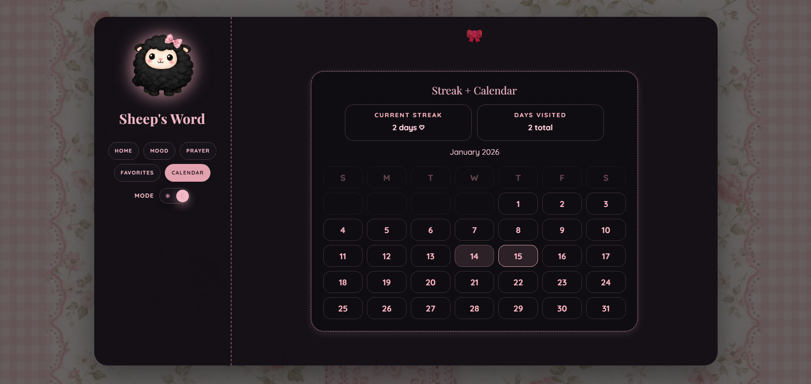
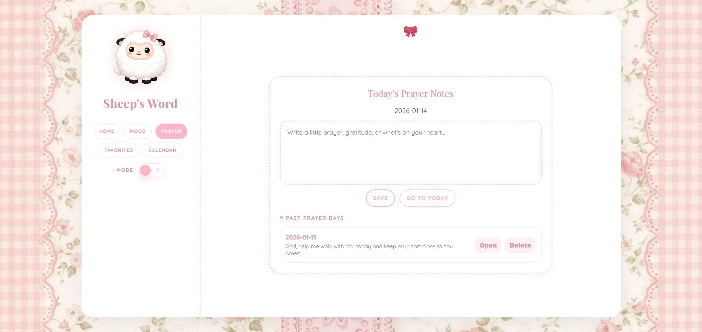

# Sheep’s Word 🎀

A tiny, coquette glassy web app that gives you a **New Testament** daily verse + sweet little extras (thoughts, prayer, and a daily challenge). 

- **Single-file site**: everything lives in `index.html`
- **Mascot energy**: `sheep2.png` (also used as favicon)
- **Pink/pastel backdrop**: `pink.png`

## ✨ Features

- **Today’s Verse** (refreshes once per 24 hours)
- **New Testament-only** verse selection
- **Fast “New Verse”** (prefetch + cancel in-flight requests)
- **Thoughts / Prayer / Daily Challenge** generated from the verse
- **Favorites** with search + scrolling list
- **Prayer journal** by date
- **Streak + calendar** view
- **Read aloud (TTS)** with pause/resume/stop
- **Coquette dark mode** toggle (black boxes + pink text)

## 🖼️ Screenshots

<div align="center">
  
  
  
  
  
</div>

## 💗 Run it locally

1. Open `index.html` directly in your browser (double-click), **or** use a tiny local server.
2. Optional local server (PowerShell):

```powershell
cd "c:\Users\mmdmc\Documents\github\verseday"
python -m http.server 5500
```

Then visit `http://localhost:5500`.

## 🧁 Notes

- Uses `localStorage` to save your theme, favorites, journal entries, and streak.
- Fetches verses from `https://bible-api.com/<reference>`.
- Requires an internet connection to load verse text.

## 🌸 Project Files

- `index.html` — the whole app (HTML/CSS/JS)
- `pink.png` — background
- `sheep2.png` — mascot + favicon
- `ss1.png` … `ss5.png` — screenshots shown above
